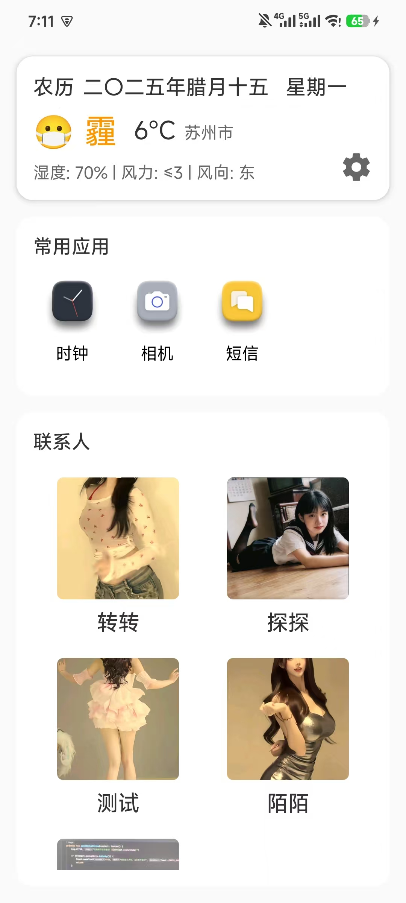
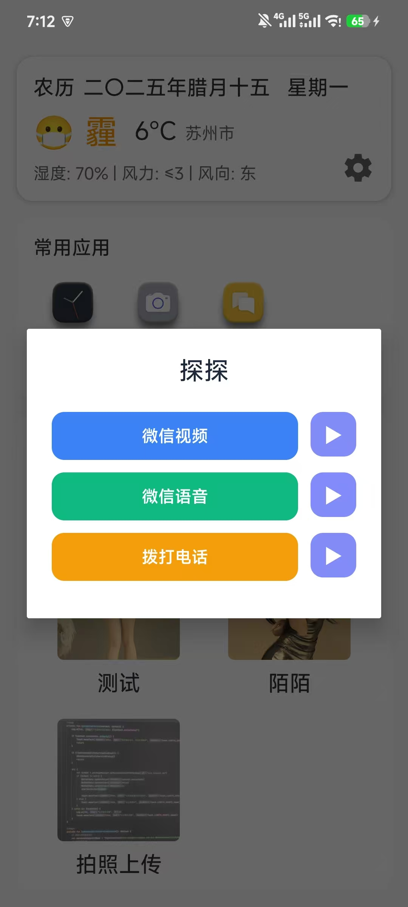
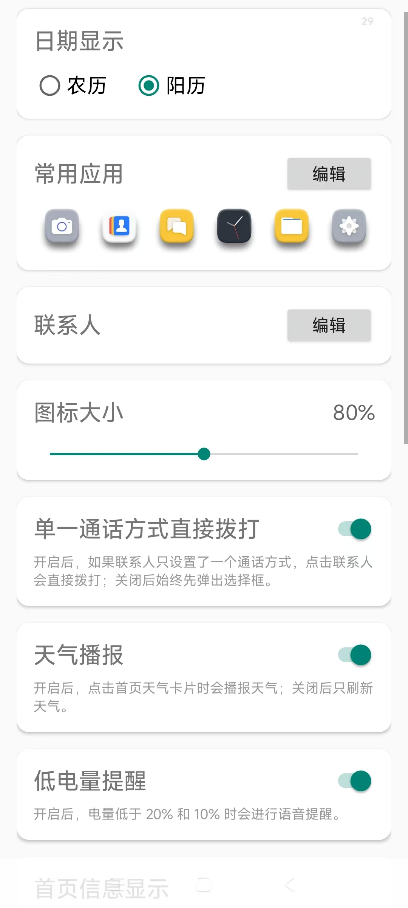
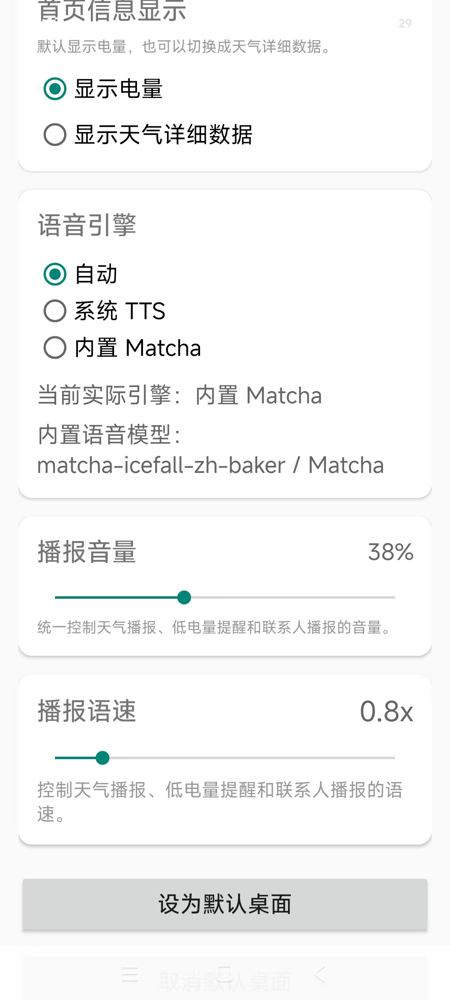
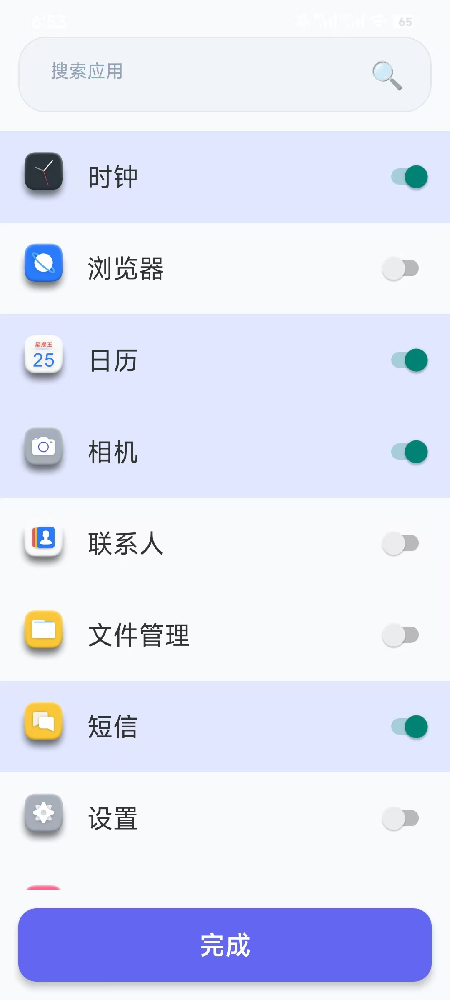
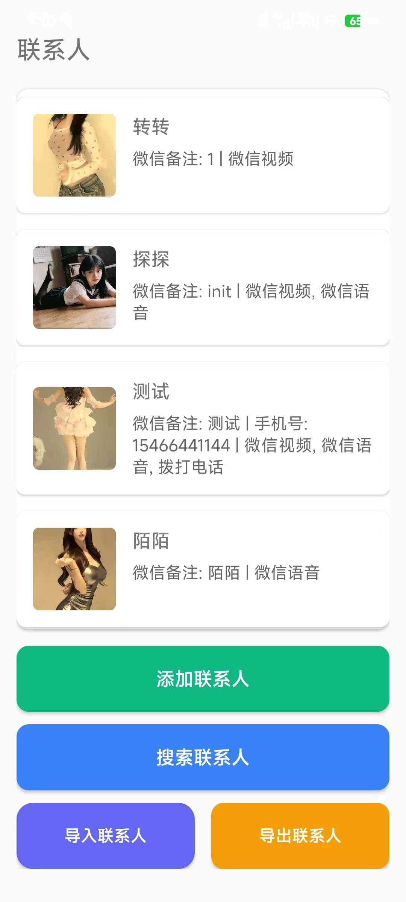
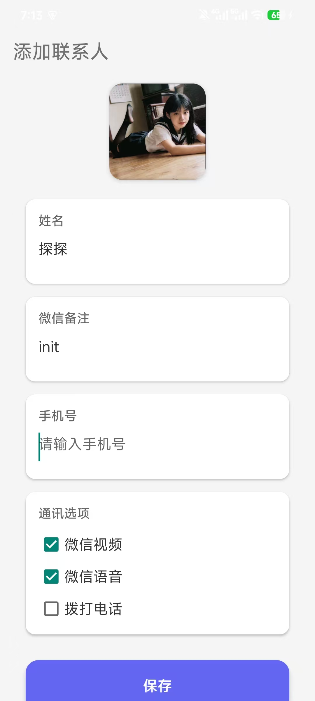
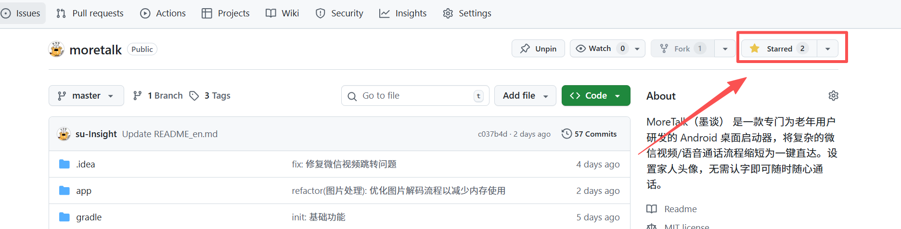

<div align="center">


<div style="border: 2px solid #3B82F6; padding: 20px; margin: 20px; display: inline-block; clip-path: polygon(0 0, 15% 0, 15% 5%, 85% 5%, 85% 0, 100% 0, 100% 100%, 85% 100%, 85% 95%, 15% 95%, 15% 100%, 0 100%);">
    <h1 style="margin: 0;">MoreTalk 智能辅助</h1>
    <p style="color: #64748b; font-size: 1.1em;"><b>一款专为长辈定制的极简 Android 桌面启动器</b></p>
</div>

[](https://android-arsenal.com/api?level=24)
[](https://kotlinlang.org)
[](LICENSE)

</div>

<p align="center">
  <a href="README_en.md">English</a> | <a href="README.md">简体中文</a>
</p>

<p align="center">
  <a href="UPDATE_LOG.md">Update Log / 更新日志</a>
</p>

---

## 📖 项目初衷

**MoreTalk** 诞生于对数字鸿沟的思考。智能手机不应成为长辈生活的阻碍。我们通过“极致减法”：
- **移除** 繁琐的扫码、支付、广告与冗余设置。
- **重塑** 核心通话路径，将复杂的微信视频流程转化为**一键直达**。
- **辅助** 利用 Accessibility 自动化技术，替长辈完成所有的“中间步骤”，让每一份牵挂都即刻送达。

---

## ✨ 核心特性

* **🏠 极简大图标桌面**：锁定布局，采用超大网格，从源头防止长辈误触或意外删除应用。
* **👥 亲情一键直达**：在联系人卡片上直接显示“视频通话”和“语音通话”按钮，无需进入微信翻找。
* **💬 自动化智慧拨号**：底层无障碍服务自动模拟点击微信菜单、弹出框及确认按钮，实现全自动化拨号。
* **🌤️ 全自动语音天气**：支持静默定位刷新，整点自动语音播报，让长辈不用看图也能知晓冷暖。
* **📅 大字农历日历**：首页醒目标注农历与阳历日期，完全贴合中国长辈的生活习惯。
* **🌐 拒绝云端**：所有数据本地化存储，支持联系人导入导出（更换手机也不怕），数据全程掌握在自己手中，绝对安全。
* **💥 数据加密**：整个生命周期运行过程中手机号均通过加密算法执行加密，进一步保障数据安全。

---

## 🛠️ 技术栈

### 核心技术
- **开发语言**：Kotlin
- **系统要求**：Android 7.0 (API 24) 及以上
- **编译版本**：Android 14 (API 36)
- **目标版本**：Android 14 (API 36)
- **应用版本**：v1.0.0 (build 1)
- **Java版本**：Java 11

### 核心框架
- **`AccessibilityService`**: 实现微信端 UI 树遍历与自动化模拟点击
- **`Coroutine + Flow`**: 响应式处理天气数据获取与 UI 更新
- **`Retrofit + GSON`**: 驱动远程天气 API 与农历转换接口
- **`FusedLocationProvider`**: 极简地理位置获取逻辑
- **`RecyclerView`**: 高效的列表与网格数据展示
- **`Material Design`**: 现代化的 UI 设计规范
- **`TextToSpeech`**: 语音播报功能

### 关键依赖
| 依赖库 | 版本 | 用途 |
|--------|------|------|
| `AndroidX Core KTX` | 最新版 | Android核心功能扩展 |
| `AndroidX AppCompat` | 最新版 | 兼容库支持 |
| `Material Components` | 最新版 | Material Design组件 |
| `Retrofit` | 2.9.0 | 网络请求框架 |
| `GSON` | 2.10.1 | JSON解析库 |
| `Kotlin Coroutines` | 1.7.3 | 异步编程框架 |
| `Play Services Location` | 21.1.0 | 位置服务 |
| `RecyclerView` | 1.3.2 | 列表展示 |
| `Lunar Library` | 1.7.7 | 农历计算 |

### 架构模式
- **MVVM架构**：模型-视图-视图模型
- **Repository模式**：数据访问层抽象
- **适配器模式**：UI组件与数据绑定
- **单例模式**：全局服务管理

### 安全特性
- **权限管理**：运行时权限申请
- **文件安全**：FileProvider安全文件访问
- **网络安全**：HTTPS加密通信

---

## 🌐运行界面-测试机型（MI 12s）
<p align="center">
  
  
  
</p>
<p align="center">
  
  
  
</p>
<p align="center">
  
</p>

## 🚀 部署与安装说明

### ✨ 获取最新功能与优化通知(推荐)




### 1. 开发者部署
* **环境准备**：安装 **Android Studio** (推荐 Jellyfish 或更高版本)。
* **源码获取**：
  ```bash
  git clone https://github.com/su-Insight/MoreTalk.git
  cd MoreTalk
  
  ```

* **构建安装**：在 Android Studio 中打开项目，等待 Gradle 同步，点击 Run 'app' 安装至真机（无障碍服务需真机环境）。

### 2. 下载构建产物 (APK)
* [点击此处下载最新正式版 APK](https://github.com/su-Insight/MoreTalk/releases/latest)

### 3. 关键配置（家属必看 ⚠️）
为了保证应用能顺畅控制微信，请务必帮长辈完成以下手动设置：

- [ ] **设为自启动（重要！）**：进入 `设置`，搜索`自启动`，选择 **MoreTalk**。(该功能未开启将导致`每次应用重启时`都需要重新开启无障碍权限)
- [ ] **开启无障碍权限（重要！）**：进入 `系统设置 -> 无障碍 -> 已安装的服务`，找到 **MoreTalk 智能辅助** 并开启。
- [ ] **录入联系人**：在应用内添加联系人时，**微信备注名**必须与微信 App 里的备注完全一致（系统将自动匹配首个搜索结果）。
- [ ] **开启定位**：确保应用拥有“始终允许”的定位权限，以便全自动更新天气。

---

## 🤝 贡献与反馈


**MoreTalk - 科技不应成为长辈的门槛。**

如果您觉得这个项目有意义，请为它点一个 **⭐️ Star**，这是我们持续优化的动力。  
如果您有更好的简化建议，欢迎提交 **Pull Request**。

### ☕ 打赏支持

如果这个项目刚好帮到了您，也欢迎请作者喝杯咖啡。您的鼓励会直接帮助这个项目继续打磨下去。

<p align="center">
  
</p>
